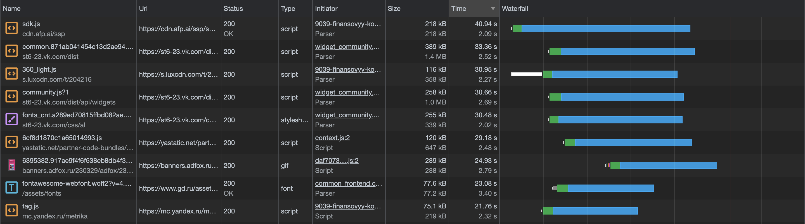
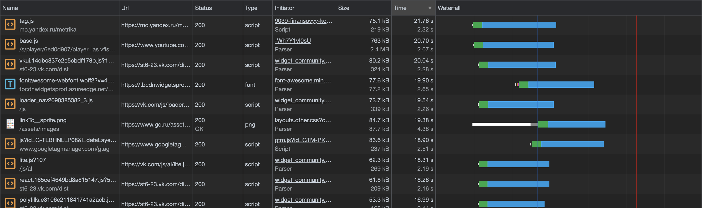
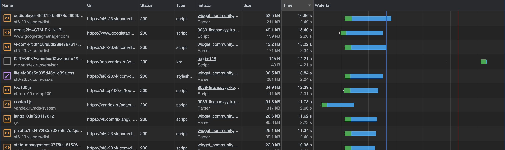
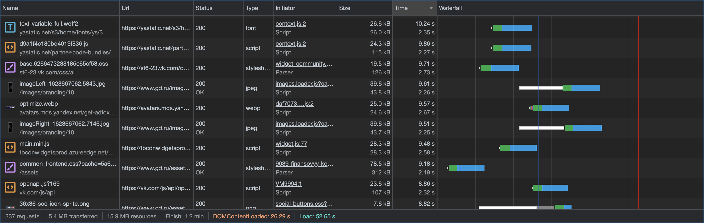
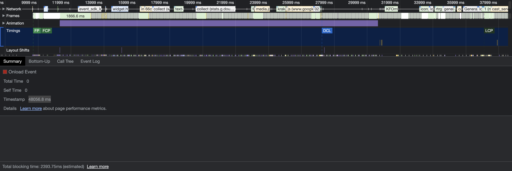
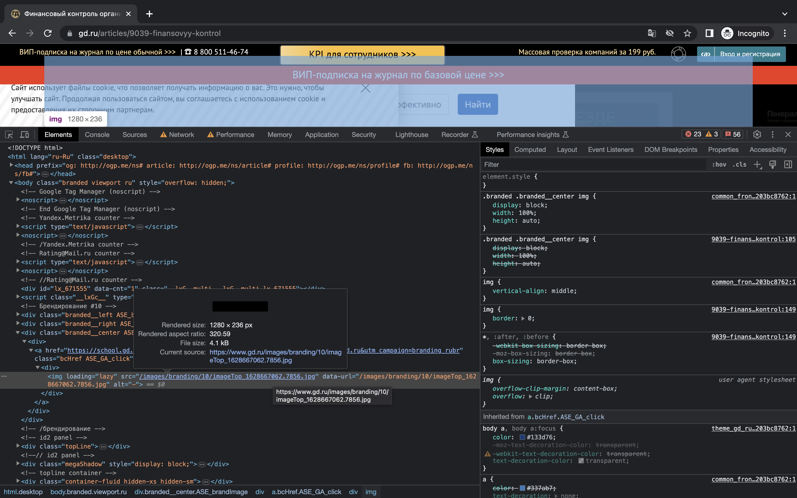
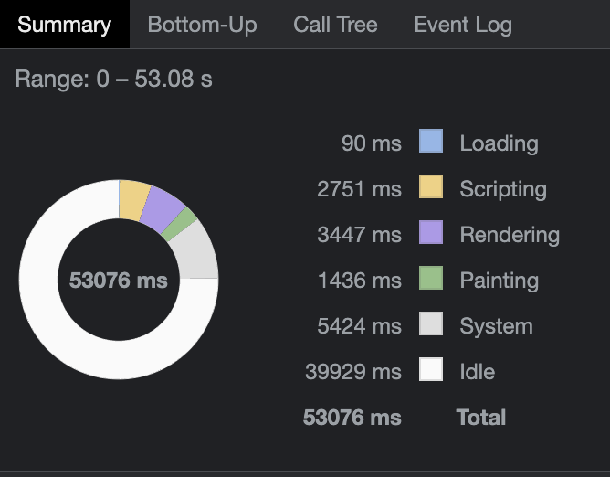
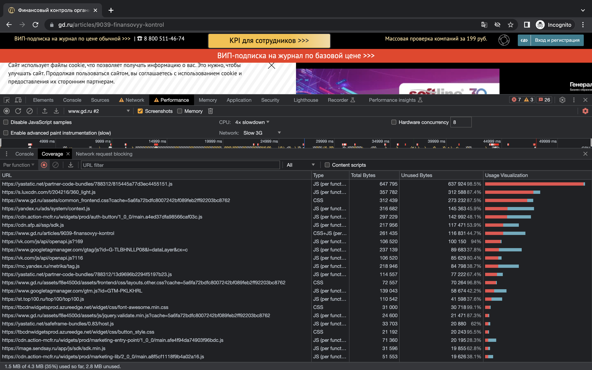
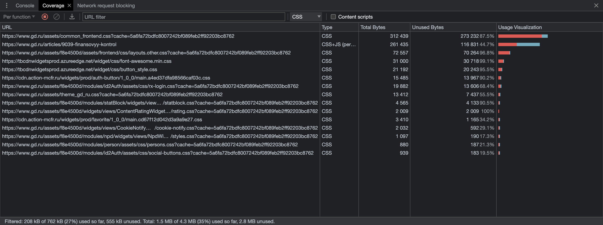
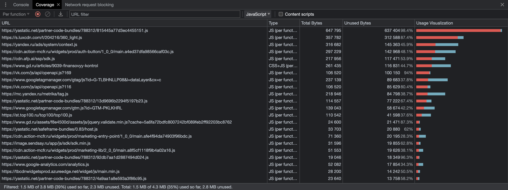

# Основное задание

Сделать в Chrome DevTools анализ открытия страницы https://www.gd.ru/articles/9039-finansovyy-kontrol. Открывать Chrome в режиме инкогнито. Использовать вкладки Network, Performance, Coverage.

## Выполнение:

1. на вкладке Network
    1. записать и сохранить в HAR архив профиль загрузки ресурсов при открытии страницы — "part-1"
    2.  найти неоптимальные места:
        1. дублирование ресурсов
        
        
        
        
        

        2. лишний размер ресурса
        - Неиспользуемые скрипты и стили
        

        3. медленно загружающиеся ресурсы
        
        

        4. ресурсы, блокирующие загрузку
        5. Прочее
        - Заблокированные запросы
        

2. на вкладке Performance
    1. записать и сохранить в файл профиль загрузки страницы — "part-2"
    2. измерить время в миллисекундах от начала навигации до событий 
        - First Paint - 887 ms
        - First Contentful Paint - 887 ms
        - DOM Content Loaded - 1313 ms
        - Largest Contentful Paint - 1700 ms
        - Load - 31381.8 ms
        
        
    3. определить, на каком DOM-элементе происходит LCP
    
    
    4. измерить, сколько времени в миллисекундах тратится на разные этапы обработки документа (Loading, Scripting, Rendering, Painting)
    
    
    
3. на вкладке Coverage
    - сохранить скриншот вкладки после загрузки страницы
    
    
    - измерить в килобайтах объём неиспользованного CSS в ходе загрузки страницы - 544 kB
    

    - измерить в килобайтах объём неиспользованного JS в ходе загрузки страницы - ~2700 kB
    

 
 

# С замедлением CPU 4x slowdown и эмуляцией сети Slow 3G

## Выполнение:

1. на вкладке Network
    1. записать и сохранить в HAR архив профиль загрузки ресурсов при открытии страницы — "slow/part-1"
    2.  найти неоптимальные места:
        1. дублирование ресурсов — те же ресурсы
        2. лишний размер ресурса
        3. медленно загружающиеся ресурсы — большая часть ресурсов загрузилась за <6с. 
        
        
        
        

2. на вкладке Performance
    1. записать и сохранить в файл профиль загрузки страницы — "slow/part-2"
    2. измерить время в миллисекундах от начала навигации до событий 
        - First Paint - 9702.1 ms
        - First Contentful Paint - 9702.1 ms
        - DOM Content Loaded - 27258.4 ms
        - Largest Contentful Paint - 37094.0 ms
        - Load - 48056.8 ms
        
    3. определить, на каком DOM-элементе происходит LCP — та же черная картинка
    
    4. измерить, сколько времени в миллисекундах тратится на разные этапы обработки документа (Loading, Scripting, Rendering, Painting)
    
    
    
3. на вкладке Coverage
    - сохранить скриншот вкладки после загрузки страницы
    
    
    - измерить в килобайтах объём неиспользованного CSS в ходе загрузки страницы - 555 kB
    

    - измерить в килобайтах объём неиспользованного JS в ходе загрузки страницы - ~2300 kB
    