# Основное задание

Сделать в Chrome DevTools анализ открытия страницы https://www.gd.ru/articles/9039-finansovyy-kontrol. Открывать Chrome в режиме инкогнито. Использовать вкладки Network, Performance, Coverage.

## Выполнение:

1. на вкладке Network
    1. записать и сохранить в HAR архив профиль загрузки ресурсов при открытии страницы
    2.  найти неоптимальные места:
        1. дублирование ресурсов
        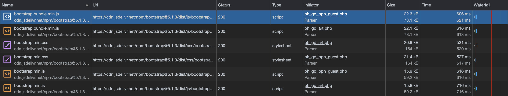
        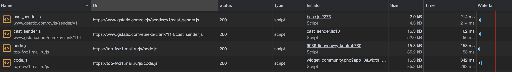
        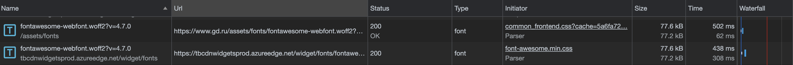
        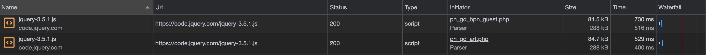
        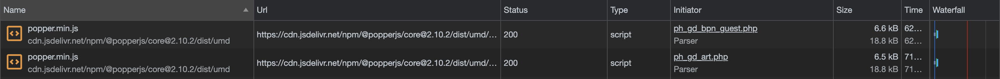

        2. лишний размер ресурса
        - Неиспользуемые скрипты и стили
        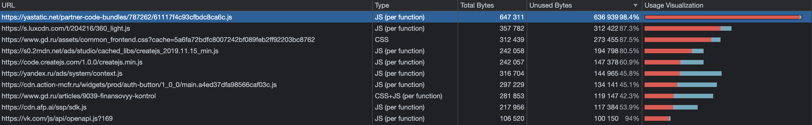

        3. медленно загружающиеся ресурсы
        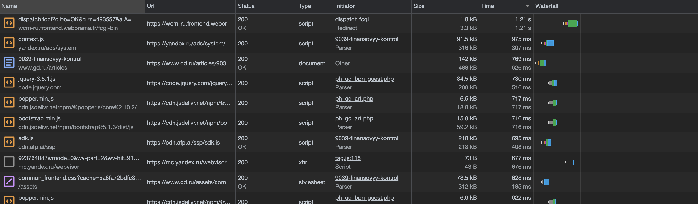
        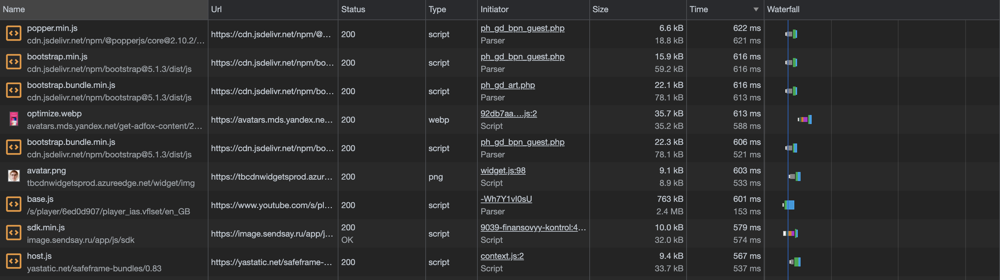

        4. ресурсы, блокирующие загрузку
        5. Прочее
        - Заблокированные запросы
        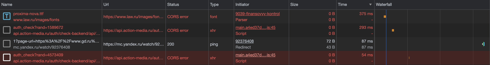

2. на вкладке Performance
    1. записать и сохранить в файл профиль загрузки страницы
    2. измерить время в миллисекундах от начала навигации до событий 
        - First Paint - 887 ms
        - First Meaningful Paint - 887 ms
        - DOM Content Loaded - 1313 ms
        - Load - 31381.8 ms
        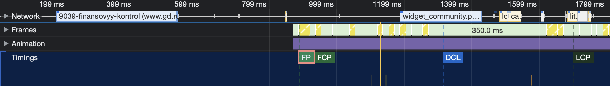
        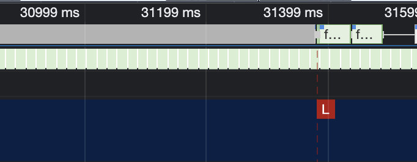
    3. определить, на каком DOM-элементе происходит LCP
    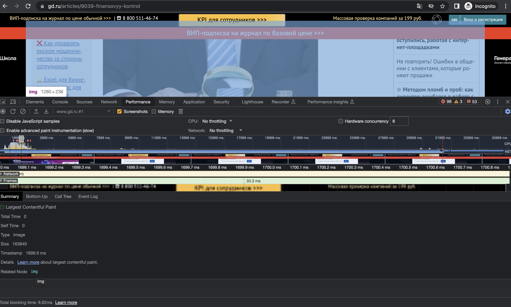
    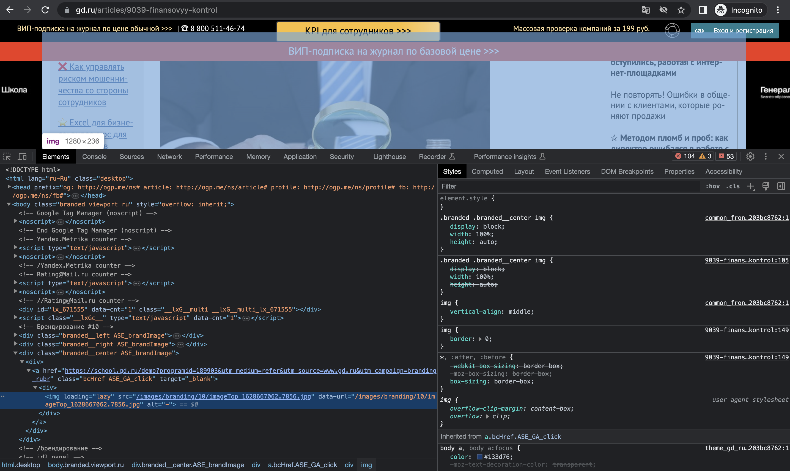
    4. измерить, сколько времени в миллисекундах тратится на разные этапы обработки документа (Loading, Scripting, Rendering, Painting)
    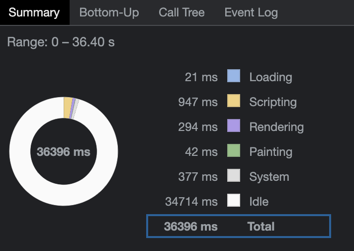
    
    
3. на вкладке Coverage
    - сохранить скриншот вкладки после загрузки страницы
    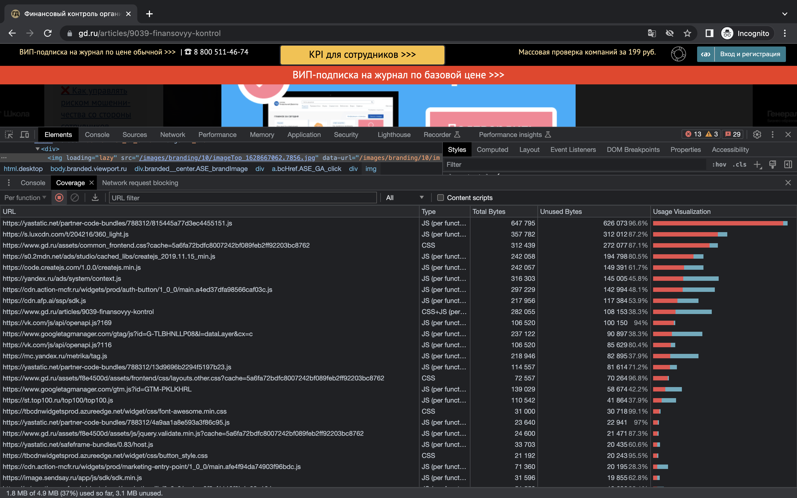
    
    - измерить в килобайтах объём неиспользованного CSS в ходе загрузки страницы - 544kB
    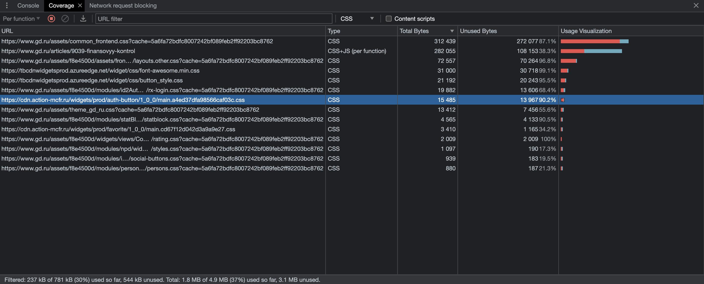

    - измерить в килобайтах объём неиспользованного JS в ходе загрузки страницы - ~2700kB
    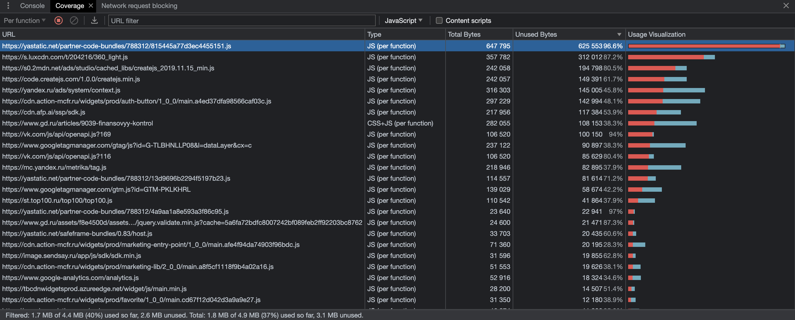